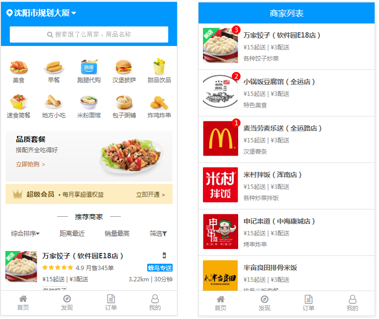
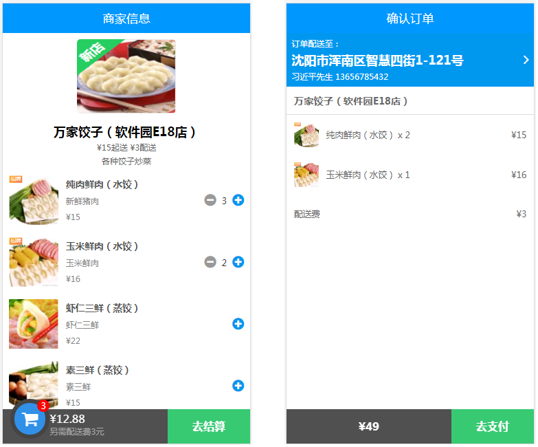
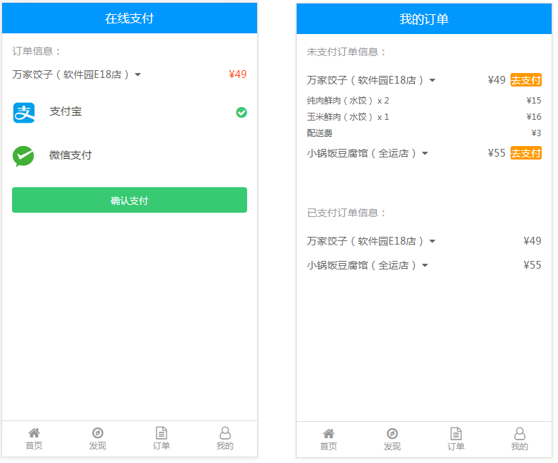
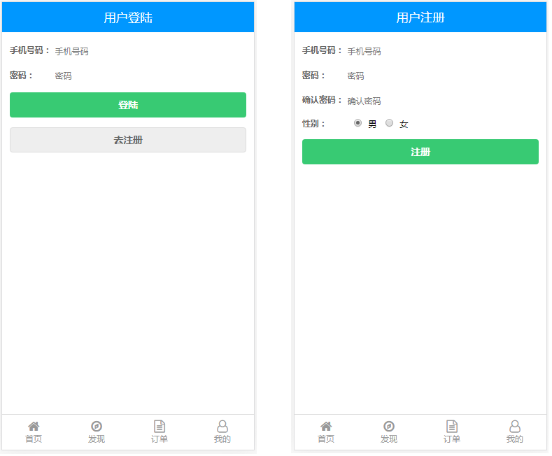
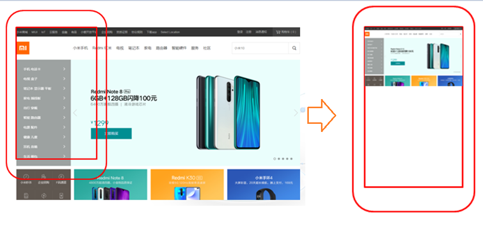

# 1.项目概述


## 1.1.项目演示
1. 运行 “饿了么前端网页项目” ，演示页面效果。
2. 本项目参照 “饿了么官网网页版”制作，演示饿了么官网效果。饿了么网页版：http://h5.ele.me/
3. 本项目中的首页，完全按照“饿了么网页版”实际效果制作，相似度达到99%。
4. 本项目中的其它页面，专注于完成一个“点餐业务线”功能，所以其它页面效果会有适当的删减。










## 1.2.项目目标
1. 本项目为课程级贯穿项目中的第二个项目（JDBC项目、**前端项目**、javaWeb项目）。
2. 本项目成果物将在第三个项目中继续使用，也就是作为第三个项目的前端网页部分。
3. 本项目完成后，学员将能够使用HTML+CSS+JS技术开发企业级静态网页。


## 1.3.项目中所涉及到相关知识点
- HTML5标签的使用
- CSS3样式的使用
- JS对DOM的基本操作
- DIV+CSS布局基础
- 移动端布局基础
- viewport设置
- 弹性布局
- 边框盒子模型
- vw与vh的使用
- 图片按比例自适应
- CSS3小图标的使用
- 第三方字体库的使用


# 2.部分相关知识点讲解


## 2.1.移动端开发之viewport
### 2.1.1.问题的提出
移动端屏幕尺寸多变，不像PC端屏幕那样统一。这样就造成在移动端显示网页时，由于尺寸问题，会出现显示不下网页，从而出现横向滚动条现象。
为了解决这个问题，出现了viewport（屏幕视口）的概念。
### 2.1.2.解决方案
viewport有三种：
1. layout viewport（布局视口）：网页实际尺寸，或者说，网页实际有多大，layout viewport就有多大。
2. ideal viewport（理想视口）：移动设备理想viewport，也就是实际屏幕尺寸，根据机型的不同，尺寸也不尽相同。
3. visualviewport（视觉视口）：用户看到的视口区域

使用viewport就可以解决上述问题：
先将网页放入layout viewport中，然后在将layout viewport等比例缩小到ideal viewport中。
这样就能保证：无论什么样的网页，都能在手机屏幕上显示，而且没有横向滚动条。



### 2.1.3.总结
> 移动端网页开发时，都要加上这样一段代码：
```html
<meta name="viewport" content="width=device-width, initial-scale=1">
```
> width就是网页实际尺寸，也就是layout viewport。
> device-width就是屏幕实际尺寸，也就是ideal viewport。
> 所以，width=device-width就是将layout viewport按照ideal viewport实际尺寸来显示。


## 2.2.	弹性布局（弹性盒子）

一个元素的display属性值设置为flex，那么这个元素中的子元素，就会遵循弹性布局的规则。

```css
display:flex  /*flex是flexible box的缩写*/
```

此时，这个元素就可以称为是一个弹性布局容器（弹性容器），它内部的子元素，将只按照弹性布局的规则来排列和对齐，以前的**float、clear、块状与内联、vertical-align属性**都不能用了。


### 2.2.1.重要概念：主轴与侧轴

弹性布局中的一个重要概念：主轴与侧轴：
弹性盒子中默认存在两根轴，一个是水平方向的主轴，一个是垂直方向的侧轴。


> 注意点：
> 1. 主轴的开始位置叫做 main start、 结束位置叫做 main end；
> 2. 侧轴的开始位置叫做cross start、结束位置叫做cross end；
> 3. 侧轴永远垂直于主轴；


### 2.2.2.flex-direction样式

flex-direction属性就是用来设置主轴方向的。

```css
flex-direction:row        /*子元素沿主轴方向排列，也就是水平方向。 row为默认值*/
```

```css
flex-direction:column     /*子元素沿侧轴方向排列，也就是垂直方向。*/
```

一个完整的例子：

```html
<!DOCTYPE html>
<html>
	<head>
		<meta charset="utf-8">
		<title></title>
		<style>
			body{
				display: flex;           /*将body设置为弹性布局*/
				flex-direction: column;  /*这里设置为侧轴方向排列*/
			}
			.son{
				width: 100px;
				height: 100px;
				border: solid 2px #f90;
				background-color: yellow;
			}
		</style>
	</head>
	<body>
		<div class="son">1</div>
		<div class="son">2</div>
		<div class="son">3</div>
		<div class="son">4</div>
		<div class="son">5</div>
	</body>
</html>
```


> 总结：
> 1. 在弹性容器中，子元素想要水平方向排列，那就在弹性盒子中设置：flex-direction:row
> 2. 在弹性容器中，子元素想要垂直方向排列，那就在弹性盒子中设置：flex-direction:column
> 3. 在弹性容器中，以前的“块状元素独占一行”，“内联元素不独占一行”，“元素水平排列时需要浮> 动”等等规则，一律不再有效。


### 2.2.3.flex-wrap样式

由于弹性布局中的子元素能自动伸缩，所以，当父容器此次小于子元素整体尺寸时，子元素不会自动换行，而是自动收缩。

```css
body{
	display: flex;
}
```


那么，如果想要让子元素自动换行，可以使用flex-wrap:wrap

```css
body{
	display: flex;
	flex-wrap: wrap;   /*当弹性布局容器尺寸小于所以子元素尺寸时，子元素会自动换行*/
}
```


> 总结：
> 1. 在弹性盒子中，默认子元素不换行，即使是容器宽度不够时，子元素也不换行，只是宽度缩小。
> 2. 如果在父容器宽度不够时想要自动换行，那么设置：flex-wrap:wrap


### 2.2.4.justify-content样式

以主轴方向为例：子元素水平方向排列后，默认依次靠左排列。
如果想让子元素居中、居右等，那么就可以设置justify-content样式。值有五种：

1. flex-start（默认）：左对齐。
2. flex-end：右对齐。
3. center：居中。
4. space-between：两端对齐，子元素之间间距都相等。
5. space-around：每个子元素两侧的间距相等。所以子元素之间间距比子元素到边框
   间距大一倍。

例如：

```css
body{
	display: flex;
	justify-content: space-between;    /*两端对齐，子元素之间间距都相等。*/
}
```


> 总结：在弹性盒子中，子元素主轴对齐方式使用justify-content来设置


### 2.2.5.align-items与align-content样式

以主轴方向为例：子元素水平方向排列后，如果想让子元素垂直居中，那么就可以设置align-items样式。常用值有三种：

1. flex-start（默认）：上对齐。
2. flex-end：下对齐。
3. center：居中。

```css
html,body{
	height: 100%;               /*html与body的高度默认为0，所以要设置高度*/
}
body{
	display: flex;
	flex-wrap: wrap;           /*如果允许换行，那么换行后，多行元素中的每一行也会垂直居中*/
	justify-content: center;
	align-items: center;       /*不论是一行，还是多行，都会垂直居中*/
}
```


再来看align-content样式：
align-content样式对单行没有效果，对多行有效果，而且是将多行整体作为一个整体附加效果的。


> 总结：在弹性盒子中，子元素侧轴对齐方式可以使用align-items或align-content
> 1. align-items对单行和多行都有效，align-content对单行无效。
> 2. 在多行中，align-items让每一行都在各自范围内垂直居中。 align-content将多行作为一个整> 体，然后居中。


### 2.2.6.flex样式

如果想让每个子元素所占空间不一致，那么可以使用flex给子元素分配空间。
使用flex时要注意一下两点：
1. flex样式是设置在子元素上的。
2. 如果设置了flex，那就说明要给子元素按比例分配空间，因此width与height就失效了。


**实例1：**

```css
<!DOCTYPE html>
<html>
	<head>
		<meta charset="utf-8">
		<title></title>
		<style>
			html,body{
				height: 100%;
			}
			body{
				display: flex;
			}
			.son{
				width: 100px;
				height: 100px;
				border: solid 2px #f90;
				background-color: yellow;
			}
		</style>
	</head>
	<body>
		<div class="son" style="flex:1;">1</div>
		<div class="son" style="flex:1;">2</div>
		<div class="son" style="flex:2;">3</div>
		<div class="son" style="flex:2;">3</div>
	</body>
</html>
```


上面实例中：flex样式后跟1个值：表示子元素所占空间的比例。
三个div的宽度分别是窗口宽度的：1/4、1/2、1/4

**实例2：**

```html
<!-- 第一个div的宽度是400px，是不变的。第二个和第三个div将剩下宽度按比例分配：1/3、2/3 -->
<body>
	<div class="son" style="flex:0 0 400px;">1</div>
	<div class="son" style="flex:1;">2</div>
	<div class="son" style="flex:2;">3</div>
</body>
```


上面实例中：flex样式后跟3个值：

1. 第一个值：子元素尺寸自动放大值
2. 第二个值：子元素尺寸自动缩小值
3. 第三个值：子元素尺寸（"auto"或"%"、"px"、"em" 或任何其他长度单位的数字。）

**例如：**
- 0 1 auto（默认）：父元素尺寸变化时，子元素不放大，只缩小，尺寸自动充满。
- 1 1 auto：                父元素尺寸变化时，子元素自动放大缩小，尺寸自动充满。
- 0 0 300px：              父元素尺寸变化时，子元素不放大缩小，尺寸固定。


> 总结：可以使用flex让一行内的所有子元素自动撑满窗口宽度。而且每个子元素的宽度可以按比例>  进行分配。


## 2.3.视口尺寸

视口：在PC端，指浏览器的可视区域；在移动端，指Viewport 中的 Layout Viewport。
视口尺寸常用的有以下2个：
vw : 1vw 等于视口宽度的1%
vh : 1vh 等于视口高度的1%
实际应用中，可以使用vw，实现元素宽度和高度成比例自动缩放。

```html
<!DOCTYPE html>
<html>
	<head>
		<meta charset="utf-8">
		<title></title>
		<style>
			div{
				width: 30vw;
				height: 20vw;
				background-color: blue;
				color: #fff;
				font-size: 5vw;
			}
		</style>
	</head>
	<body>
		<div>
			我能够随着屏幕自适应
		</div>
	</body>
</html>
```


## 2.4.边框盒子模型

CSS3之前的盒子模型，可以说是content-box型盒子，即宽和高为内容。
CSS3之后新增了一的盒子模型，可以说是border-box型盒子，即宽和高为边框。
那么，使用box-sizing属性可以设置盒子模型类型。

```css
div{
	width: 200px;
	height: 200px;
    
    box-sizing: border-box;   /*值有两个： border-box：边框盒子； content-box：内容盒子（默认）*/
	padding: 30px;
	background-color: orange;
	border: solid 30px blue;
	margin: 50px;
}
```

> 总结：使用了边框盒子，就可以任意设置内边距、边框了，而且不用担心会改变盒子的总体尺寸。


## 2.5. 字体图标

一般来说，在网页上使用字体图标可以有三种方式：自定义CSS图标、第三方字体图标、转义字符


### 2.5.1.自定义CSS图标

下面是一个自定义CSS小图标：定位图标（icon.css文件）

```css
/**
 * location 定位小图标 
 * 说明：使用div标签，加上icon-location类样式即可。
 *       但需要放置在一个容器中，调整容器大小，图标能自适应容器大小。
 * 示例：
 * <div class="icon-location-box">
 *     <div class="icon-location"></div>
 * </div>
 */
.icon-location {
	position: relative;
	width: 100%;                         /*先画一个正方形*/
	height: 100%;
	border-radius: 50% 50% 50% 0;        /*然后将三个角变成圆角*/
	background: #fff;
	transform: rotate(-45deg);           /*最后，旋转45度*/
}
.icon-location:after {        
	content: '';
	width: 40%;
	height: 40%;
	margin: 30% 0 0 29%;
	background-color: #0097FF;
	position: absolute;
	border-radius: 50%;
}
```
使用时：
```html
<!DOCTYPE html>
<html>
	<head>
		<meta charset="utf-8">
		<title></title>
		<link href="css/icon.css" rel="stylesheet">
		<style>
			.icon-location-box{
				width: 50px;
				height: 50px;
			}
		</style>
	</head>
	<body bgcolor="#0000FF">
		<div class="icon-location-box">
		    <div class="icon-location"></div>
		</div>
	</body>
</html>
```


### 2.5.2.使用第三方字体图标库

第三方字体图标库有很多很多，比如常用的：
Font Awesome：https://fontawesome.dashgame.com/      （直接在官网上进行讲解）


### 2.5.3.使用转义字符

HTML转义字符：http://114.xixik.com/character/     （直接在此网站上进行讲解）


# 3.项目实战


## 3.1.搭建项目结构


- css文件夹：                存放css文件。
- framework文件夹：  存放第三方库文件，以及一些共通的css文件（自定义css图标、css重置）
- img：                           存放图片
- js：                               存放js文件


CSS重置：reset.css文件中的内容：

```css
/***************** CSS重置 *******************/
html,body,div,span,h1,h2,h3,h4,h5,h6,ul,ol,li,p{
	margin: 0;
	padding: 0;
}
html,body{
	width: 100%;
	height: 100%;
	font-family: "微软雅黑";
}
ul,ol{
	list-style:none;
}
a{
	text-decoration: none;
}
```


## 3.2.首页（index.html）


### 3.2.1.html部分

```html
<!DOCTYPE html>
<html>
	<head>
		<meta charset="utf-8">
		<meta name="viewport" content="width=device-width,initial-scale=1">
		<link href="framework/font-awesome/css/font-awesome.min.css" rel="stylesheet">
		<link href="framework/reset.css" rel="stylesheet">
		<link href="framework/icon.css" rel="stylesheet">
		<link href="css/index.css" rel="stylesheet">
		<script src="js/index.js"></script>
		<title>饿了么 首页</title>
	</head>
	<body>
		<!-- 总容器 -->
		<div class="wrapper">
			<!-- header部分 -->
			<header>
				<div class="icon-location-box">
				    <div class="icon-location"></div>
				</div>
				<div class="location-text">沈阳市规划大厦<i class="fa fa-caret-down"></i></div>
			</header>
			
			<!-- search部分 -->
			<!-- 
			    搜索框部分（此块与search-fixed-top块宽度高度一致，用于当
				search-fixed-top块固定后，挡住下面块不要窜上去） 
			-->
			<div class="search">
				<!-- 当滚动条超过上面的定位块时，search-fixed-top块变成固定在顶部。 -->
				<div class="search-fixed-top" id="fixedBox">
					<!-- 搜索框部分中间的白框 -->
					<div class="search-box">
						<i class="fa fa-search"></i>搜索饿了么商家、商品名称
					</div>
				</div>
			</div>
			
			<!-- 点餐分类部分 -->
			<ul class="foodtype">
				<li onclick="location.href='businessList.html'">
					
					<p>美食</p>
				</li>
				<li onclick="location.href='businessList.html'">
					
					<p>早餐</p>
				</li>
				<li onclick="location.href='businessList.html'">
					
					<p>跑腿代购</p>
				</li>
				<li onclick="location.href='businessList.html'">
					
					<p>汉堡披萨</p>
				</li>
				<li onclick="location.href='businessList.html'">
					
					<p>甜品饮品</p>
				</li>
				<li onclick="location.href='businessList.html'">
					
					<p>速食简餐</p>
				</li>
				<li onclick="location.href='businessList.html'">
					
					<p>地方小吃</p>
				</li>
				<li onclick="location.href='businessList.html'">
					
					<p>米粉面馆</p>
				</li>
				<li onclick="location.href='businessList.html'">
					
					<p>包子粥铺</p>
				</li>
				<li onclick="location.href='businessList.html'">
					
					<p>炸鸡炸串</p>
				</li>
			</ul>
			
			<!-- 横幅广告部分 -->
			<div class="banner">
				<h3>品质套餐</h3>
				<p>搭配齐全吃得好</p>
				<a>立即抢购 &gt;</a>
			</div>
			
			<!-- 超级会员部分 -->
			<div class="supermember">
				<div class="left">
					
					<h3>超级会员</h3>
					<p>&#8226; 每月享超值权益</p>
				</div>
				<div class="right">
					立即开通 &gt;
				</div>
			</div>
			
			<!-- 推荐商家部分 -->
			<div class="recommend">
				<div class="recommend-line"></div>
				<p>推荐商家</p>
				<div class="recommend-line"></div>
			</div>
			
			<!-- 推荐方式部分 -->
			<ul class="recommendtype">
				<li>综合排序<i class="fa fa-caret-down"></i></li>
				<li>距离最近</li>
				<li>销量最高</li>
				<li>筛选<i class="fa fa-filter"></i></li>
			</ul>
			
			<!-- 推荐商家列表部分 -->
			<ul class="business">
				<li>
					
					<div class="business-info">
						<div class="business-info-h">
							<h3>万家饺子（软件园E18店）</h3>
							<div class="business-info-like">&#8226;</div>
						</div>
						<div class="business-info-star">
							<div class="business-info-star-left">
								<i class="fa fa-star"></i>
								<i class="fa fa-star"></i>
								<i class="fa fa-star"></i>
								<i class="fa fa-star"></i>
								<i class="fa fa-star"></i>
								<p>4.9 月售345单</p>
							</div>
							<div class="business-info-star-right">
								蜂鸟专送
							</div>
						</div>
						<div class="business-info-delivery">
							<p>&#165;15起送 | &#165;3配送</p>
							<p>3.22km | 30分钟</p>
						</div>
						<div class="business-info-explain">
							<div>各种饺子</div>
						</div>
						<div class="business-info-promotion">
							<div class="business-info-promotion-left">
								<div class="business-info-promotion-left-incon">新</div>
								<p>饿了么新用户首单立减9元</p>
							</div>
							<div class="business-info-promotion-right">
								<p>2个活动</p>
								<i class="fa fa-caret-down"></i>
							</div>
						</div>
						<div class="business-info-promotion">
							<div class="business-info-promotion-left">
								<div class="business-info-promotion-left-incon" style="background-color: #F1884F;">特</div>
								<p>特价商品5元起</p>
							</div>
						</div>
					</div>
				</li>
				<li>
					
					<div class="business-info">
						<div class="business-info-h">
							<h3>小锅饭豆腐馆（全运店）</h3>
							<div class="business-info-like">&#8226;</div>
						</div>
						<div class="business-info-star">
							<div class="business-info-star-left">
								<i class="fa fa-star"></i>
								<i class="fa fa-star"></i>
								<i class="fa fa-star"></i>
								<i class="fa fa-star"></i>
								<i class="fa fa-star"></i>
								<p>4.9 月售345单</p>
							</div>
							<div class="business-info-star-right">
								蜂鸟专送
							</div>
						</div>
						<div class="business-info-delivery">
							<p>&#165;15起送 | &#165;3配送</p>
							<p>3.22km | 30分钟</p>
						</div>
						<div class="business-info-explain">
							<div>各种饺子</div>
						</div>
						<div class="business-info-promotion">
							<div class="business-info-promotion-left">
								<div class="business-info-promotion-left-incon">新</div>
								<p>饿了么新用户首单立减9元</p>
							</div>
							<div class="business-info-promotion-right">
								<p>2个活动</p>
								<i class="fa fa-caret-down"></i>
							</div>
						</div>
						<div class="business-info-promotion">
							<div class="business-info-promotion-left">
								<div class="business-info-promotion-left-incon">特</div>
								<p>特价商品5元起</p>
							</div>
						</div>
					</div>
				</li>
				<li>
					
					<div class="business-info">
						<div class="business-info-h">
							<h3>麦当劳麦乐送（全运路店）</h3>
							<div class="business-info-like">&#8226;</div>
						</div>
						<div class="business-info-star">
							<div class="business-info-star-left">
								<i class="fa fa-star"></i>
								<i class="fa fa-star"></i>
								<i class="fa fa-star"></i>
								<i class="fa fa-star"></i>
								<i class="fa fa-star"></i>
								<p>4.9 月售345单</p>
							</div>
							<div class="business-info-star-right">
								蜂鸟专送
							</div>
						</div>
						<div class="business-info-delivery">
							<p>&#165;15起送 | &#165;3配送</p>
							<p>3.22km | 30分钟</p>
						</div>
						<div class="business-info-explain">
							<div>各种饺子</div>
						</div>
						<div class="business-info-promotion">
							<div class="business-info-promotion-left">
								<div class="business-info-promotion-left-incon">新</div>
								<p>饿了么新用户首单立减9元</p>
							</div>
							<div class="business-info-promotion-right">
								<p>2个活动</p>
								<i class="fa fa-caret-down"></i>
							</div>
						</div>
						<div class="business-info-promotion">
							<div class="business-info-promotion-left">
								<div class="business-info-promotion-left-incon">特</div>
								<p>特价商品5元起</p>
							</div>
						</div>
					</div>
				</li>
				<li>
					
					<div class="business-info">
						<div class="business-info-h">
							<h3>米村拌饭（浑南店）</h3>
							<div class="business-info-like">&#8226;</div>
						</div>
						<div class="business-info-star">
							<div class="business-info-star-left">
								<i class="fa fa-star"></i>
								<i class="fa fa-star"></i>
								<i class="fa fa-star"></i>
								<i class="fa fa-star"></i>
								<i class="fa fa-star"></i>
								<p>4.9 月售345单</p>
							</div>
							<div class="business-info-star-right">
								蜂鸟专送
							</div>
						</div>
						<div class="business-info-delivery">
							<p>&#165;15起送 | &#165;3配送</p>
							<p>3.22km | 30分钟</p>
						</div>
						<div class="business-info-explain">
							<div>各种饺子</div>
						</div>
						<div class="business-info-promotion">
							<div class="business-info-promotion-left">
								<div class="business-info-promotion-left-incon">新</div>
								<p>饿了么新用户首单立减9元</p>
							</div>
							<div class="business-info-promotion-right">
								<p>2个活动</p>
								<i class="fa fa-caret-down"></i>
							</div>
						</div>
						<div class="business-info-promotion">
							<div class="business-info-promotion-left">
								<div class="business-info-promotion-left-incon">特</div>
								<p>特价商品5元起</p>
							</div>
						</div>
					</div>
				</li>
				<li>
					
					<div class="business-info">
						<div class="business-info-h">
							<h3>申记串道（中海康城店）</h3>
							<div class="business-info-like">&#8226;</div>
						</div>
						<div class="business-info-star">
							<div class="business-info-star-left">
								<i class="fa fa-star"></i>
								<i class="fa fa-star"></i>
								<i class="fa fa-star"></i>
								<i class="fa fa-star"></i>
								<i class="fa fa-star"></i>
								<p>4.9 月售345单</p>
							</div>
							<div class="business-info-star-right">
								蜂鸟专送
							</div>
						</div>
						<div class="business-info-delivery">
							<p>&#165;15起送 | &#165;3配送</p>
							<p>3.22km | 30分钟</p>
						</div>
						<div class="business-info-explain">
							<div>各种饺子</div>
						</div>
						<div class="business-info-promotion">
							<div class="business-info-promotion-left">
								<div class="business-info-promotion-left-incon">新</div>
								<p>饿了么新用户首单立减9元</p>
							</div>
							<div class="business-info-promotion-right">
								<p>2个活动</p>
								<i class="fa fa-caret-down"></i>
							</div>
						</div>
						<div class="business-info-promotion">
							<div class="business-info-promotion-left">
								<div class="business-info-promotion-left-incon">特</div>
								<p>特价商品5元起</p>
							</div>
						</div>
					</div>
				</li>
			</ul>
			
			<!-- 底部菜单部分 -->
			<ul class="footer">
				<li onclick="location.href='index.html'">
					<i class="fa fa-home"></i>
					<p>首页</p>
				</li>
				<li>
					<i class="fa fa-compass"></i>
					<p>发现</p>
				</li>
				<li onclick="location.href='orderList.html'">
					<i class="fa fa-file-text-o"></i>
					<p>订单</p>
				</li>
				<li>
					<i class="fa fa-user-o"></i>
					<p>我的</p>
				</li>
			</ul>
		</div>
	</body>
</html>
```

### 3.2.2.css部分

```css
/****************** 总容器 ******************/
.wrapper{
	width: 100%;
	height: 100%;
}

/****************** header ******************/
.wrapper header{
	width: 100%;
	height: 12vw;
	background-color: #0097FF;
	
	display: flex;
	align-items: center;
}
.wrapper header .icon-location-box{
	width: 3.5vw;
	height: 3.5vw;
	margin: 0 1vw 0 3vw;
}
.wrapper header .location-text{
	font-size: 4.5vw;
	font-weight: 700;
	color: #fff;
}
.wrapper header .location-text .fa-caret-down{
	margin-left: 1vw;
}

/****************** search ******************/
.wrapper .search{
	width: 100%;
	height: 13vw;
}
.wrapper .search .search-fixed-top{
	width: 100%;
	height: 13vw;
	background-color: #0097FF;
	display: flex;
	justify-content: center;
	align-items: center;
}
.wrapper .search .search-fixed-top .search-box{
	width: 90%;
	height: 9vw;
	background-color: #fff;
	border-radius: 2px;
	
	display: flex;
	justify-content: center;
	align-items: center;
	
	font-size: 3.5vw;
	color: #AEAEAE;
	font-family: "宋体";
	/*此样式是让文本选中状态无效*/
	user-select: none;
}
.wrapper .search .search-fixed-top .search-box .fa-search{
	margin-right: 1vw;
}

/****************** 点餐分类部分 ******************/
.wrapper .foodtype{
	width: 100%;
	height: 48vw;
	
	display: flex;
	flex-wrap: wrap;
	justify-content: space-around;
	/*要使用align-content。10个子元素将自动换行为两行，而且两行作为一个整体垂直居中*/
	align-content: center;
}
.wrapper .foodtype li{
	/*一共10个子元素，通过计算，子元素宽度在16.7 ~ 20 之间，才能保证换两行*/
	width: 18vw;
	height: 20vw;
	
	display: flex;
	/*弹性盒子主轴方向设为column，然后仍然是垂直水平方向居中*/
	flex-direction: column;
	justify-content: center;
	align-items: center;
	
	user-select: none;
	cursor: pointer;
}
.wrapper .foodtype li img{
	width: 12vw;
	/*视频讲解时高度设置为12vw，实际上设置为10.3vw更佳*/
	height: 10.3vw;
}
.wrapper .foodtype li p{
	font-size: 3.2vw;
	color: #666;
}

/****************** 横幅广告部分 ******************/
.wrapper .banner{
	/**
	 * 设置容器宽度95%，然后水平居中，这样两边留白; 
	 * 这里不能用padding，因为背景图片也会覆盖padding
	 */
	width: 95%;
	margin: 0 auto;
	height: 29vw;
	
	/*此三个样式组合，可以保证背景图片充满整个容器*/
	background-image: url(../img/index_banner.png);
	background-repeat: no-repeat;
	background-size: cover;
	
	box-sizing: border-box;
	padding: 2vw 6vw;
}
.wrapper .banner h3{
	font-size: 4.2vw;
	margin-bottom: 1.2vw;
}
.wrapper .banner p{
	font-size: 3.4vw;
	color: #666;
	margin-bottom: 2.4vw;
}
.wrapper .banner a{
	font-size: 3vw;
	color: #C79060;
	font-weight: 700;
}

/****************** 超级会员部分 ******************/
.wrapper .supermember{
	/*这里也设置容器宽度95%，不能用padding，因为背景色也会充满padding*/
	width: 95%;
	margin: 0 auto;
	height: 11.5vw;
	background-color: #FEEDC1;
	margin-top: 1.3vw;
	border-radius: 2px;
	color: #644F1B;
	
	display: flex;
	justify-content: space-between;
	align-items: center;
}
.wrapper .supermember .left{
	display: flex;
	align-items: center;
	margin-left: 4vw;
	user-select: none;
}
.wrapper .supermember .left img{
	width: 6vw;
	height: 6vw;
	margin-right: 2vw;
}
.wrapper .supermember .left h3{
	font-size: 4vw;
	margin-right: 2vw;
}
.wrapper .supermember .left p{
	font-size: 3vw;
}
.wrapper .supermember .right{
	font-size: 3vw;
	margin-right: 4vw;
	cursor: pointer;
}

/****************** 推荐商家部分 ******************/
.wrapper .recommend{
	width: 100%;
	height: 14vw;
	display: flex;
	justify-content: center;
	align-items: center;
}
.wrapper .recommend .recommend-line{
	width: 6vw;
	height: 0.2vw;
	background-color: #888;
}
.wrapper .recommend p{
	font-size: 4vw;
	margin: 0 4vw;
}

/****************** 推荐方式部分 ******************/
.wrapper .recommendtype{
	width: 100%;
	height: 5vw;
	margin-bottom: 5vw;
	
	display: flex;
	justify-content: space-around;
	align-items: center;
}
.wrapper .recommendtype li{
	font-size: 3.5vw;
	color: #555;
}

/****************** 推荐商家列表部分 ******************/
.wrapper .business{
	width: 100%;
	margin-bottom: 14vw;
}
.wrapper .business li{
	width: 100%;
	box-sizing: border-box;
	padding: 2.5vw;
	user-select: none;
	border-bottom: solid 1px #DDD;
	
	display: flex;
}
.wrapper .business li img{
	width: 18vw;
	height: 18vw;
}
.wrapper .business li .business-info{
	width: 100%;
	box-sizing: border-box;
	padding-left: 3vw;
}
.wrapper .business li .business-info .business-info-h{
	display: flex;
	justify-content: space-between;
	align-items: center;
	margin-bottom: 2vw;
}
.wrapper .business li .business-info .business-info-h h3{
	font-size: 4vw;
	color: #333;
}
.wrapper .business li .business-info .business-info-h .business-info-like{
	width: 1.6vw;
	height: 3.4vw;
	background-color: #666;
	color: #fff;
	font-size: 4vw;
	margin-right: 4vw;
	
	display: flex;
	justify-content: center;
	align-items: center;
}
.wrapper .business li .business-info .business-info-star{
	display: flex;
	justify-content: space-between;
	align-items: center;
	margin-bottom: 2vw;
	font-size: 3.1vw;
}
.wrapper .business li .business-info .business-info-star .business-info-star-left{
	display: flex;
	align-items: center;
}
.wrapper .business li .business-info .business-info-star .business-info-star-left .fa-star{
	color: #FEC80E;
	margin-right: 0.5vw;
}
.wrapper .business li .business-info .business-info-star .business-info-star-left p{
	color: #666;
	margin-left: 1vw;
}
.wrapper .business li .business-info .business-info-star .business-info-star-right{
	background-color: #0097FF;
	color: #fff;
	font-size: 2.4vw;
	border-radius: 2px;
	padding: 0 0.6vw;
}
.wrapper .business li .business-info .business-info-delivery{
	display: flex;
	justify-content: space-between;
	align-items: center;
	margin-bottom: 2vw;
	
	color: #666;
	font-size: 3.1vw;
}
.wrapper .business li .business-info .business-info-explain{
	display: flex;
	align-items: center;
	margin-bottom: 3vw;
}
.wrapper .business li .business-info .business-info-explain div{
	border: solid 1px #DDD;
	font-size: 2.8vw;
	color: #666;
	border-radius: 3px;
	padding: 0 0.1vw ;
}
.wrapper .business li .business-info .business-info-promotion{
	display: flex;
	justify-content: space-between;
	align-items: center;
	margin-bottom: 1.8vw;
}
.wrapper .business li .business-info .business-info-promotion .business-info-promotion-left{
	display: flex;
	align-items: center;
}
.wrapper .business li .business-info .business-info-promotion .business-info-promotion-left .business-info-promotion-left-incon{
	width: 4vw;
	height: 4vw;
	background-color: #70BC46;
	border-radius: 3px;
	font-size: 3vw;
	color: #fff;
	
	display: flex;
	justify-content: center;
	align-items: center;
}
.wrapper .business li .business-info .business-info-promotion .business-info-promotion-left p{
	color: #666;
	font-size: 3vw;
	margin-left: 2vw;
}
.wrapper .business li .business-info .business-info-promotion .business-info-promotion-right{
	display: flex;
	align-items: center;
	font-size: 2.5vw;
	color: #999;
}
.wrapper .business li .business-info .business-info-promotion .business-info-promotion-right p{
	margin-right: 2vw;
}

/****************** 底部菜单部分 ******************/
.wrapper .footer{
	width: 100%;
	height: 14vw;
	border-top: solid 1px #DDD;
	background-color: #fff;
	
	position: fixed;
	left: 0;
	bottom: 0;
	
	display: flex;
	justify-content: space-around;
	align-items: center;
}
.wrapper .footer li{
	/*li本身的尺寸完全由内容撑起*/
	display: flex;
	flex-direction: column;
	justify-content: center;
	align-items: center;
	
	color: #999;
	user-select: none;
	cursor: pointer;
}
.wrapper .footer li p{
	font-size: 2.8vw;
}
.wrapper .footer li i{
	font-size: 5vw;
}


```


## 3.3.商家列表页面（businessList.html）

### 3.3.1.html部分

```html
<!DOCTYPE html>
<html>
	<head>
		<meta charset="utf-8">
		<meta name="viewport" content="width=device-width,initial-scale=1">
		<link href="framework/font-awesome/css/font-awesome.min.css" rel="stylesheet">
		<link href="framework/reset.css" rel="stylesheet">
		<link href="css/businessList.css" rel="stylesheet">
		<title>饿了么 商家列表</title>
	</head>
	<body>
		<div class="wrapper">
			
			<!-- header部分 -->
			<header>
				<p>商家列表</p>
			</header>
			
			<!-- 商家列表部分 -->
			<ul class="business">
				<li onclick="location.href='businessInfo.html'">
					<div class="business-img">
						
						<div class="business-img-quantity">3</div>
					</div>
					<div class="business-info">
						<h3>万家饺子（软件园E18店）</h3>
						<p>&#165;15起送 | &#165;3配送</p>
						<p>各种饺子炒菜</p>
					</div>
				</li>
				<li onclick="location.href='businessInfo.html'">
					<div class="business-img">
						
						<div class="business-img-quantity">2</div>
					</div>
					<div class="business-info">
						<h3>小锅饭豆腐馆（全运店）</h3>
						<p>&#165;15起送 | &#165;3配送</p>
						<p>特色美食</p>
					</div>
				</li>
				<li onclick="location.href='businessInfo.html'">
					<div class="business-img">
						
						<div class="business-img-quantity">1</div>
					</div>
					<div class="business-info">
						<h3>麦当劳麦乐送（全运路店）</h3>
						<p>&#165;15起送 | &#165;3配送</p>
						<p>汉堡薯条</p>
					</div>
				</li>
				<li onclick="location.href='businessInfo.html'">
					<div class="business-img">
						
					</div>
					<div class="business-info">
						<h3>米村拌饭（浑南店）</h3>
						<p>&#165;15起送 | &#165;3配送</p>
						<p>各种炒菜拌饭</p>
					</div>
				</li>
				<li onclick="location.href='businessInfo.html'">
					<div class="business-img">
						
					</div>
					<div class="business-info">
						<h3>申记串道（中海康城店）</h3>
						<p>&#165;15起送 | &#165;3配送</p>
						<p>烤串炸串</p>
					</div>
				</li>
				<li onclick="location.href='businessInfo.html'">
					<div class="business-img">
						
					</div>
					<div class="business-info">
						<h3>半亩良田排骨米饭</h3>
						<p>&#165;15起送 | &#165;3配送</p>
						<p>排骨米饭套餐</p>
					</div>
				</li>
				<li onclick="location.href='businessInfo.html'">
					<div class="business-img">
						
					</div>
					<div class="business-info">
						<h3>茶兮鲜果饮品（国际软件园店）</h3>
						<p>&#165;15起送 | &#165;3配送</p>
						<p>甜品饮品</p>
					</div>
				</li>
				<li onclick="location.href='businessInfo.html'">
					<div class="business-img">
						
					</div>
					<div class="business-info">
						<h3>唯一水果捞（软件园E18店）</h3>
						<p>&#165;15起送 | &#165;3配送</p>
						<p>新鲜水果</p>
					</div>
				</li>
				<li onclick="location.href='businessInfo.html'">
					<div class="business-img">
						
					</div>
					<div class="business-info">
						<h3>满园春饼（全运路店）</h3>
						<p>&#165;15起送 | &#165;3配送</p>
						<p>各种春饼</p>
					</div>
				</li>
			</ul>
			
			<!-- 底部菜单部分 -->
			<ul class="footer">
				<li onclick="location.href='index.html'">
					<i class="fa fa-home"></i>
					<p>首页</p>
				</li>
				<li>
					<i class="fa fa-compass"></i>
					<p>发现</p>
				</li>
				<li onclick="location.href='orderList.html'">
					<i class="fa fa-file-text-o"></i>
					<p>订单</p>
				</li>
				<li>
					<i class="fa fa-user-o"></i>
					<p>我的</p>
				</li>
			</ul>
			
		</div>
	</body>
</html>
```


### 3.3.2.css部分

```css
/****************** 总容器 ******************/
.wrapper{
	width: 100%;
	height: 100%;
}

/****************** header部分 ******************/
.wrapper header{
	width: 100%;
	height: 12vw;
	background-color: #0097FF;
	color: #fff;
	font-size: 4.8vw;
	
	position: fixed;
	left: 0;
	top: 0;
	z-index: 1000;
	
	display: flex;
	justify-content: center;
	align-items: center;
}

/****************** 商家列表部分 ******************/
.wrapper .business{
	width: 100%;
	margin-top: 12vw;
	margin-bottom: 14vw;
}
.wrapper .business li{
	width: 100%;
	box-sizing: border-box;
	padding: 2.5vw;
	border-bottom: solid 1px #DDD;
	user-select: none;
	cursor: pointer;
	
	display: flex;
	align-items: center;
}
.wrapper .business li .business-img{
	/*这里设置为相当定位，成为business-img-quantity元素的父元素*/
	position: relative;
}
.wrapper .business li .business-img img{
	width: 20vw;
	height: 20vw;
}
.wrapper .business li .business-img .business-img-quantity{
	width: 5vw;
	height: 5vw;
	background-color: red;
	color: #fff;
	font-size: 3.6vw;
	border-radius: 2.5vw;
	
	display: flex;
	justify-content: center;
	align-items: center;
	
	/*设置成绝对定位，不占文档流空间*/
	position: absolute;
	right: -1.5vw;
	top: -1.5vw;
}
.wrapper .business li .business-info{
	margin-left: 3vw;
}
.wrapper .business li .business-info h3{
	font-size: 3.8vw;
	color: #555;
}
.wrapper .business li .business-info p{
	font-size: 3vw;
	color: #888;
	margin-top: 2vw;
}
/****************** 底部菜单部分 ******************/
.wrapper .footer{
	width: 100%;
	height: 14vw;
	border-top: solid 1px #DDD;
	background-color: #fff;
	
	position: fixed;
	left: 0;
	bottom: 0;
	
	display: flex;
	justify-content: space-around;
	align-items: center;
}
.wrapper .footer li{
	display: flex;
	flex-direction: column;
	justify-content: center;
	align-items: center;
	
	color: #999;
	user-select: none;
	cursor: pointer;
}
.wrapper .footer li p{
	font-size: 2.8vw;
}
.wrapper .footer li i{
	font-size: 5vw;
}
```


## 3.4.商家信息页面（businessInfo.html）

### 3.4.1.html部分

```html
<!DOCTYPE html>
<html>
	<head>
		<meta charset="utf-8">
		<meta name="viewport" content="width=device-width,initial-scale=1">
		<link href="framework/font-awesome/css/font-awesome.min.css" rel="stylesheet">
		<link href="framework/reset.css" rel="stylesheet">
		<link href="css/businessInfo.css" rel="stylesheet">
		<title>饿了么 商家信息</title>
	</head>
	<body>
		<div class="wrapper">
			
			<!-- header部分 -->
			<header>
				<p>商家信息</p>
			</header>
			
			<!-- 商家logo部分 -->
			<div class="business-logo">
				
			</div>
			
			<!-- 商家信息部分 -->
			<div class="business-info">
				<h1>万家饺子（软件园E18店）</h1>
				<p>&#165;15起送 &#165;3配送</p>
				<p>各种饺子炒菜</p>
			</div>
			
			<!-- 食品列表部分 -->
			<ul class="food">
				<li>
					<div class="food-left">
						
						<div class="food-left-info">
							<h3>纯肉鲜肉（水饺）</h3>
							<p>新鲜猪肉</p>
							<p>&#165;15</p>
						</div>
					</div>
					<div class="food-right">
						<div>
							<i class="fa fa-minus-circle"></i>
						</div>
						<p><span>3</span></p>
						<div>
							<i class="fa fa-plus-circle"></i>
						</div>
					</div>
				</li>
				<li>
					<div class="food-left">
						
						<div class="food-left-info">
							<h3>玉米鲜肉（水饺）</h3>
							<p>玉米鲜肉</p>
							<p>&#165;16</p>
						</div>
					</div>
					<div class="food-right">
						<div>
							<i class="fa fa-minus-circle"></i>
						</div>
						<p><span>2</span></p>
						<div>
							<i class="fa fa-plus-circle"></i>
						</div>
					</div>
				</li>
				<li>
					<div class="food-left">
						
						<div class="food-left-info">
							<h3>虾仁三鲜（蒸饺）</h3>
							<p>虾仁三鲜</p>
							<p>&#165;22</p>
						</div>
					</div>
					<div class="food-right">
						<div>
						</div>
						<p></p>
						<div>
							<i class="fa fa-plus-circle"></i>
						</div>
					</div>
				</li>
				<li>
					<div class="food-left">
						
						<div class="food-left-info">
							<h3>素三鲜（蒸饺）</h3>
							<p>素三鲜</p>
							<p>&#165;15</p>
						</div>
					</div>
					<div class="food-right">
						<div>
						</div>
						<p></p>
						<div>
							<i class="fa fa-plus-circle"></i>
						</div>
					</div>
				</li>
				<li>
					<div class="food-left">
						
						<div class="food-left-info">
							<h3>角瓜鸡蛋（蒸饺）</h3>
							<p>角瓜鸡蛋</p>
							<p>&#165;16</p>
						</div>
					</div>
					<div class="food-right">
						<div>
						</div>
						<p></p>
						<div>
							<i class="fa fa-plus-circle"></i>
						</div>
					</div>
				</li>
				<li>
					<div class="food-left">
						
						<div class="food-left-info">
							<h3>小白菜肉（水饺）</h3>
							<p>小白菜肉</p>
							<p>&#165;18</p>
						</div>
					</div>
					<div class="food-right">
						<div>
						</div>
						<p></p>
						<div>
							<i class="fa fa-plus-circle"></i>
						</div>
					</div>
				</li>
				<li>
					<div class="food-left">
						
						<div class="food-left-info">
							<h3>芹菜牛肉（水饺）</h3>
							<p>芹菜牛肉</p>
							<p>&#165;18</p>
						</div>
					</div>
					<div class="food-right">
						<div>
						</div>
						<p></p>
						<div>
							<i class="fa fa-plus-circle"></i>
						</div>
					</div>
				</li>
			</ul>
			
			<!-- 购物车部分 -->
			<div class="cart">
				<div class="cart-left">
					<div class="cart-left-icon">
						<i class="fa fa-shopping-cart"></i>
						<div class="cart-left-icon-quantity">3</div>
					</div>
					<div class="cart-left-info">
						<p>&#165;12.88</p>
						<p>另需配送费3元</p>
					</div>
				</div>
				<div class="cart-right">
					<!-- 不够起送费 -->
					<!--
					<div class="cart-right-item">
						&#165;15起送
					</div>
					-->
					<!-- 达到起送费 -->
					<div class="cart-right-item" onclick="location.href='order.html'">
					    去结算
					</div>
				</div>
			</div>
			
		</div>	
	</body>
</html>
```


### 3.4.2.css部分

```css
/****************** 总容器 ******************/
.wrapper{
	width: 100%;
	height: 100%;
}

/****************** header部分 ******************/
.wrapper header{
	width: 100%;
	height: 12vw;
	background-color: #0097FF;
	color: #fff;
	font-size: 4.8vw;
	
	position: fixed;
	left: 0;
	top: 0;
	z-index: 1000;
	
	display: flex;
	justify-content: center;
	align-items: center;
}

/****************** 商家logo部分 ******************/
.wrapper .business-logo{
	width: 100%;
	height: 35vw;
	/*使用上外边距避开header部分*/
	margin-top: 12vw;
	
	display: flex;
	justify-content: center;
	align-items: center;
}
.wrapper .business-logo img{
	width: 40vw;
	height: 30vw;
	border-radius: 5px;
}

/****************** 商家信息部分 ******************/
.wrapper .business-info{
	width: 100%;
	height: 20vw;
	
	display: flex;
	flex-direction: column;
	justify-content: center;
	align-items: center;
}
.wrapper .business-info h1{
	font-size: 5vw;
}
.wrapper .business-info p{
	font-size: 3vw;
	color: #666;
	margin-top: 1vw;
}

/****************** 食品列表部分 ******************/
.wrapper .food{
	width: 100%;
	/*使用下外边距避开footer部分*/
	margin-bottom: 14vw;
}
.wrapper .food li{
	width: 100%;
	box-sizing: border-box;
	padding: 2.5vw;
	user-select: none;
	
	display: flex;
	justify-content: space-between;
	align-items: center;
}
.wrapper .food li .food-left{
	display: flex;
	align-items: center;
}
.wrapper .food li .food-left img{
	width: 20vw;
	height: 20vw;
}
.wrapper .food li .food-left .food-left-info{
	margin-left: 3vw;
}
.wrapper .food li .food-left .food-left-info h3{
	font-size: 3.8vw;
	color: #555;
}
.wrapper .food li .food-left .food-left-info p{
	font-size: 3vw;
	color: #888;
	margin-top: 2vw;
}
.wrapper .food li .food-right{
	width: 16vw;
	display: flex;
	justify-content: space-between;
	align-items: center;
}
.wrapper .food li .food-right .fa-minus-circle{
	font-size: 5.5vw;
	color: #999;
	cursor: pointer;
}
.wrapper .food li .food-right p{
	font-size: 3.6vw;
	color: #333;
}
.wrapper .food li .food-right .fa-plus-circle{
	font-size: 5.5vw;
	color: #0097EF;
	cursor: pointer;
}

/****************** 购物车部分 ******************/
.wrapper .cart{
	width: 100%;
	height: 14vw;
	
	position: fixed;
	left: 0;
	bottom: 0;
	
	display: flex;
}
.wrapper .cart .cart-left{
	flex: 2;
	background-color: #505051;
	display: flex;
}
.wrapper .cart .cart-left .cart-left-icon{
	width: 16vw;
	height: 16vw;
	box-sizing: border-box;
	border: solid 1.6vw #444;
	border-radius: 8vw;
	background-color: #3190E8;
	font-size: 7vw;
	color: #fff;
	
	display: flex;
	justify-content: center;
	align-items: center;
	
	margin-top: -4vw;
	margin-left: 3vw;
	
	position: relative;
}
.wrapper .cart .cart-left .cart-left-icon-quantity{
	width: 5vw;
	height: 5vw;
	border-radius: 2.5vw;
	background-color: red;
	color: #fff;
	font-size: 3.6vw;
	
	display: flex;
	justify-content: center;
	align-items: center;
	
	position: absolute;
	right: -1.5vw;
	top: -1.5vw;
}
.wrapper .cart .cart-left .cart-left-info p:first-child{
	font-size: 4.5vw;
	color: #fff;
	margin-top: 1vw;
}
.wrapper .cart .cart-left .cart-left-info p:last-child{
	font-size: 2.8vw;
	color: #AAA;
}

.wrapper .cart .cart-right{
	flex: 1;
}
/*达到起送费时的样式*/
.wrapper .cart .cart-right .cart-right-item{
	width: 100%;
	height: 100%;
	background-color: #38CA73;
	color: #fff;
	font-size: 4.5vw;
	font-weight: 700;
	user-select: none;
	cursor: pointer;
	
	display: flex;
	justify-content: center;
	align-items: center;
}

/*不够起送费时的样式（只有背景色和鼠标样式的区别）*/
/*
.wrapper .cart .cart-right .cart-right-item{
	width: 100%;
	height: 100%;
	background-color: #535356;
	color: #fff;
	font-size: 4.5vw;
	font-weight: 700;
	user-select: none;
	
	display: flex;
	justify-content: center;
	align-items: center;
}
*/
```


## 3.5.确认订单页面（order.html）

### 3.5.1.html部分

```html
<!DOCTYPE html>
<html>
	<head>
		<meta charset="utf-8">
		<meta name="viewport" content="width=device-width,initial-scale=1">
		<link href="framework/font-awesome/css/font-awesome.min.css" rel="stylesheet">
		<link href="framework/reset.css" rel="stylesheet">
		<link href="css/order.css" rel="stylesheet">
		<title>饿了么 确认订单</title>
	</head>
	<body>
		<div class="wrapper">
			
			<!-- header部分 -->
			<header>
				<p>确认订单</p>
			</header>
		
			<!-- 订单信息部分 -->
			<div class="order-info">
				<h5>订单配送至：</h5>
				<div class="order-info-address">
					<p>沈阳市浑南区智慧四街1-121号</p>
					<i class="fa fa-angle-right"></i>
				</div>
				<p>习近平先生 13656785432</p>
			</div>
			
			<h3>万家饺子（软件园E18店）</h3>

			<!-- 订单明细部分 -->
			<ul class="order-detailed">
				<li>
					<div class="order-detailed-left">
						
						<p>纯肉鲜肉（水饺） x 2</p>
					</div>
					<p>&#165;15</p>
				</li>
				<li>
					<div class="order-detailed-left">
						
						<p>玉米鲜肉（水饺） x 1</p>
					</div>
					<p>&#165;16</p>
				</li>
			</ul>
			<div class="order-deliveryfee">
				<p>配送费</p>
				<p>&#165;3</p>
			</div>
			
			<!-- 合计部分 -->
			<div class="total">
				<div class="total-left">
					&#165;49
				</div>
				<div class="total-right" onclick="location.href='payment.html'">
					去支付
				</div>
			</div>
		</div>	
	</body>
</html>
```

### 3.5.2.css部分

```css
/****************** 总容器 ******************/
.wrapper{
	width: 100%;
	height: 100%;
}

/****************** header部分 ******************/
.wrapper header{
	width: 100%;
	height: 12vw;
	background-color: #0097FF;
	color: #fff;
	font-size: 4.8vw;
	
	position: fixed;
	left: 0;
	top: 0;
	z-index: 1000;
	
	display: flex;
	justify-content: center;
	align-items: center;
}

/****************** 订单信息部分 ******************/
.wrapper .order-info{
	/*注意这里，不设置高，靠内容撑开。因为地址有可能折行*/
	width: 100%;
	margin-top: 12vw;
	background-color: #0097EF;
	box-sizing: border-box;
	padding: 2vw;
	color: #fff;
}
.wrapper .order-info h5{
	font-size: 3vw;
	font-weight: 300;
}
.wrapper .order-info .order-info-address{
	width: 100%;
	display: flex;
	justify-content: space-between;
	align-items: center;
	
	font-weight: 700;
	user-select: none;
	cursor: pointer;
	margin: 1vw 0;
}
.wrapper .order-info .order-info-address p{
	width: 90%;
	font-size: 5vw;
}
.wrapper .order-info .order-info-address i{
	font-size: 6vw;
}
.wrapper .order-info p{
	font-size: 3vw;
}

.wrapper h3{
	box-sizing: border-box;
	padding: 3vw;
	font-size: 4vw;
	color: #666;
	border-bottom: solid 1px #DDD;
}

/****************** 订单明细部分 ******************/
.wrapper .order-detailed{
	width: 100%;
}
.wrapper .order-detailed li{
	width: 100%;
	height: 16vw;
	box-sizing: border-box;
	padding: 3vw;
	color: #666;
	
	display: flex;
	justify-content: space-between;
	align-items: center;
}
.wrapper .order-detailed li .order-detailed-left{
	display: flex;
	align-items: center;
}
.wrapper .order-detailed li .order-detailed-left img{
	width: 10vw;
	height: 10vw;
}
.wrapper .order-detailed li .order-detailed-left p{
	font-size: 3.5vw;
	margin-left: 3vw;
}
.wrapper .order-detailed li p{
	font-size: 3.5vw;
}
.wrapper .order-deliveryfee{
	width: 100%;
	height: 16vw;
	box-sizing: border-box;
	padding: 3vw;
	color: #666;
	display: flex;
	justify-content: space-between;
	align-items: center;
	font-size: 3.5vw;
}

/****************** 订单合计部分 ******************/
.wrapper .total{
	width: 100%;
	height: 14vw;
	
	position: fixed;
	left: 0;
	bottom: 0;
	
	display: flex;
}
.wrapper .total .total-left{
	flex: 2;
	background-color: #505051;
	color: #fff;
	font-size: 4.5vw;
	font-weight: 700;
	user-select: none;
	
	display: flex;
	justify-content: center;
	align-items: center;
}
.wrapper .total .total-right{
	flex: 1;
	background-color: #38CA73;
	color: #fff;
	font-size: 4.5vw;
	font-weight: 700;
	user-select: none;
	cursor: pointer;
	
	display: flex;
	justify-content: center;
	align-items: center;
}
```


## 3.6.在线支付页面（payment.html）

### 3.6.1.html部分

```html
<!DOCTYPE html>
<html>
	<head>
		<meta charset="utf-8">
		<meta name="viewport" content="width=device-width,initial-scale=1">
		<link href="framework/font-awesome/css/font-awesome.min.css" rel="stylesheet">
		<link href="framework/reset.css" rel="stylesheet">
		<link href="css/payment.css" rel="stylesheet">
		<script src="js/payment.js"></script>
		<title>饿了么 在线支付</title>
	</head>
	<body>
		<div class="wrapper">
			
			<!-- header部分 -->
			<header>
				<p>在线支付</p>
			</header>
			
			<!-- 订单信息部分 -->
			<h3>订单信息：</h3>
			<div class="order-info">
				<p>
					万家饺子（软件园E18店）
					<i class="fa fa-caret-down" id="showBtn"></i>
				</p>
				<p>&#165;49</p>
			</div>
			
			<!-- 订单明细部分 -->
			<ul class="order-detailet" id="detailetBox">
				<li>
					<p>纯肉鲜肉（水饺） x 2</p>
					<p>&#165;15</p>
				</li>
				<li>
					<p>玉米鲜肉（水饺） x 1</p>
					<p>&#165;16</p>
				</li>
				<li>
					<p>配送费</p>
					<p>&#165;3</p>
				</li>
			</ul>
			
			<!-- 支付方式部分 -->
			<ul class="payment-type">
				<li>
					
					<i class="fa fa-check-circle"></i>
				</li>
				<li>
					
				</li>
			</ul>
			<div class="payment-button">
				<button>确认支付</button>
			</div>
			
			<!-- 底部菜单部分 -->
			<ul class="footer">
				<li onclick="location.href='index.html'">
					<i class="fa fa-home"></i>
					<p>首页</p>
				</li>
				<li>
					<i class="fa fa-compass"></i>
					<p>发现</p>
				</li>
				<li onclick="location.href='orderList.html'">
					<i class="fa fa-file-text-o"></i>
					<p>订单</p>
				</li>
				<li>
					<i class="fa fa-user-o"></i>
					<p>我的</p>
				</li>
			</ul>
		</div>	
	</body>
</html>
```

### 3.6.2.css部分

```css
/****************** 总容器 ******************/
.wrapper{
	width: 100%;
	height: 100%;
}

/****************** header部分 ******************/
.wrapper header{
	width: 100%;
	height: 12vw;
	background-color: #0097FF;
	color: #fff;
	font-size: 4.8vw;
	
	position: fixed;
	left: 0;
	top: 0;
	z-index: 1000;
	
	display: flex;
	justify-content: center;
	align-items: center;
}

/****************** 订单信息部分 ******************/
.wrapper h3{
	margin-top: 12vw;
	box-sizing: border-box;
	padding: 4vw 4vw 0;
	
	font-size: 4vw;
	font-weight: 300;
	color: #999;
}
.wrapper .order-info{
	box-sizing: border-box;
	padding: 4vw;
	font-size: 4vw;
	color: #666;
	
	display: flex;
	justify-content: space-between;
	align-items: center;
}
.wrapper .order-info p:last-child{
	color: orangered;
}
/****************** 订单明细部分 ******************/
.wrapper .order-detailet{
	width: 100%;
}
.wrapper .order-detailet li{
	width: 100%;
	box-sizing: border-box;
	padding: 1vw 4vw;
	
	display: flex;
	justify-content: space-between;
	align-items: center;
}
.wrapper .order-detailet li p{
	font-size: 3vw;
	color: #666;
}

/****************** 支付方式部分 ******************/
.wrapper .payment-type{
	width: 100%;
}
.wrapper .payment-type li{
	width: 100%;
	box-sizing: border-box;
	padding: 4vw;
	
	display: flex;
	justify-content: space-between;
	align-items: center;
}
.wrapper .payment-type li img{
	width: 33vw;
	height: 8.9vw;
}
.wrapper .payment-type li .fa-check-circle{
	font-size: 5vw;
	color: #38CA73;
}
.wrapper .payment-button{
	width: 100%;
	box-sizing: border-box;
	padding: 4vw;
}
.wrapper .payment-button button{
	width: 100%;
	height: 10vw;
	border: none;
	/*去掉外轮廓线*/
	outline: none;
	border-radius: 4px;
	background-color: #38CA73;
	color: #fff;
}
/****************** 底部菜单部分 ******************/
.wrapper .footer{
	width: 100%;
	height: 14vw;
	border-top: solid 1px #DDD;
	background-color: #fff;
	
	position: fixed;
	left: 0;
	bottom: 0;
	
	display: flex;
	justify-content: space-around;
	align-items: center;
}
.wrapper .footer li{
	display: flex;
	flex-direction: column;
	justify-content: center;
	align-items: center;
	
	color: #999;
	user-select: none;
	cursor: pointer;
}
.wrapper .footer li p{
	font-size: 2.8vw;
}
.wrapper .footer li i{
	font-size: 5vw;
}
```


## 3.7.历史订单页面（orderList.html）

### 3.7.1.html部分

```html
<!DOCTYPE html>
<html>
	<head>
		<meta charset="utf-8">
		<meta name="viewport" content="width=device-width,initial-scale=1">
		<link href="framework/font-awesome/css/font-awesome.min.css" rel="stylesheet">
		<link href="framework/reset.css" rel="stylesheet">
		<link href="css/orderList.css" rel="stylesheet">
		<script src="js/orderList.js"></script>
		<title>饿了么 我的订单</title>
	</head>
	<body>
		
		<div class="wrapper">
			
			<!-- header部分 -->
			<header>
				<p>我的订单</p>
			</header>
			
			<!-- 订单列表部分 -->
			<h3>未支付订单信息：</h3>
			<ul class="order">
				<li>
					<div class="order-info">
						<p>
							万家饺子（软件园E18店）
							<i class="fa fa-caret-down"></i>
						</p>
						<div class="order-info-right">
							<p>&#165;49</p>
							<div class="order-info-right-icon">去支付</div>
						</div>
					</div>
					<ul class="order-detailet">
						<li>
							<p>纯肉鲜肉（水饺） x 2</p>
							<p>&#165;15</p>
						</li>
						<li>
							<p>玉米鲜肉（水饺） x 1</p>
							<p>&#165;16</p>
						</li>
						<li>
							<p>配送费</p>
							<p>&#165;3</p>
						</li>
					</ul>
				</li>
				<li>
					<div class="order-info">
						<p>
							小锅饭豆腐馆（全运店）
							<i class="fa fa-caret-down"></i>
						</p>
						<div class="order-info-right">
							<p>&#165;55</p>
							<div class="order-info-right-icon">去支付</div>
						</div>
					</div>
					<ul class="order-detailet">
						<li>
							<p>纯肉鲜肉（水饺） x 2</p>
							<p>&#165;15</p>
						</li>
						<li>
							<p>玉米鲜肉（水饺） x 1</p>
							<p>&#165;16</p>
						</li>
						<li>
							<p>配送费</p>
							<p>&#165;3</p>
						</li>
					</ul>
				</li>
			</ul>
			
			<h3>已支付订单信息：</h3>
			<ul class="order">
				<li>
					<div class="order-info">
						<p>
							万家饺子（软件园E18店）
							<i class="fa fa-caret-down"></i>
						</p>
						<div class="order-info-right">
							<p>&#165;49</p>
						</div>
					</div>
					<ul class="order-detailet">
						<li>
							<p>纯肉鲜肉（水饺） x 2</p>
							<p>&#165;15</p>
						</li>
						<li>
							<p>玉米鲜肉（水饺） x 1</p>
							<p>&#165;16</p>
						</li>
						<li>
							<p>配送费</p>
							<p>&#165;3</p>
						</li>
					</ul>
				</li>
				<li>
					<div class="order-info">
						<p>
							小锅饭豆腐馆（全运店）
							<i class="fa fa-caret-down"></i>
						</p>
						<div class="order-info-right">
							<p>&#165;55</p>
						</div>
					</div>
					<ul class="order-detailet">
						<li>
							<p>纯肉鲜肉（水饺） x 2</p>
							<p>&#165;15</p>
						</li>
						<li>
							<p>玉米鲜肉（水饺） x 1</p>
							<p>&#165;16</p>
						</li>
						<li>
							<p>配送费</p>
							<p>&#165;3</p>
						</li>
					</ul>
				</li>
			</ul>
			
			<!-- 底部菜单部分 -->
			<ul class="footer">
				<li onclick="location.href='index.html'">
					<i class="fa fa-home"></i>
					<p>首页</p>
				</li>
				<li>
					<i class="fa fa-compass"></i>
					<p>发现</p>
				</li>
				<li onclick="location.href='orderList.html'">
					<i class="fa fa-file-text-o"></i>
					<p>订单</p>
				</li>
				<li>
					<i class="fa fa-user-o"></i>
					<p>我的</p>
				</li>
			</ul>
			
		</div>	
	</body>
</html>
```

### 3.7.2.css部分

```css
/****************** 总容器 ******************/
.wrapper{
	width: 100%;
	height: 100%;
}

/****************** header部分 ******************/
.wrapper header{
	width: 100%;
	height: 12vw;
	background-color: #0097FF;
	color: #fff;
	font-size: 4.8vw;
	
	position: fixed;
	left: 0;
	top: 0;
	z-index: 1000;
	
	display: flex;
	justify-content: center;
	align-items: center;
}

/****************** 历史订单列表部分 ******************/
.wrapper h3{
	margin-top: 12vw;
	box-sizing: border-box;
	padding: 4vw;
	font-size: 4vw;
	font-weight: 300;
	color: #999;
}
.wrapper .order{
	width: 100%;
}
.wrapper .order li{
	width: 100%;
}
.wrapper .order li .order-info{
	box-sizing: border-box;
	padding: 2vw 4vw;
	font-size: 4vw;
	color: #666;
	
	display: flex;
	justify-content: space-between;
	align-items: center;
}
.wrapper .order li .order-info .order-info-right{
	display: flex;
}
.wrapper .order li .order-info .order-info-right .order-info-right-icon{
	background-color: #f90;
	color: #fff;
	border-radius: 3px;
	margin-left: 2vw;
	user-select: none;
	cursor: pointer;
}

.wrapper .order li .order-detailet{
	width: 100%;
}
.wrapper .order li .order-detailet li{
	width: 100%;
	box-sizing: border-box;
	padding: 1vw 4vw;
	color: #666;
	font-size: 3vw;
	
	display: flex;
	justify-content: space-between;
	align-items: center;
}
/****************** 底部菜单部分 ******************/
.wrapper .footer{
	width: 100%;
	height: 14vw;
	border-top: solid 1px #DDD;
	background-color: #fff;
	
	position: fixed;
	left: 0;
	bottom: 0;
	
	display: flex;
	justify-content: space-around;
	align-items: center;
}
.wrapper .footer li{
	display: flex;
	flex-direction: column;
	justify-content: center;
	align-items: center;
	
	color: #999;
	user-select: none;
	cursor: pointer;
}
.wrapper .footer li p{
	font-size: 2.8vw;
}
.wrapper .footer li i{
	font-size: 5vw;
}
```


## 3.8.登陆页面（login.html）

### 3.8.1.html部分

```html
<!DOCTYPE html>
<html>
	<head>
		<meta charset="utf-8">
		<meta name="viewport" content="width=device-width,initial-scale=1">
		<link href="framework/font-awesome/css/font-awesome.min.css" rel="stylesheet">
		<link href="framework/reset.css" rel="stylesheet">
		<link href="css/login.css" rel="stylesheet">
		<title>饿了么 用户登陆</title>
	</head>
	<body>
		<div class="wrapper">
			
			<!-- header部分 -->
			<header>
				<p>用户登陆</p>
			</header>
			
			<!-- 表单部分 -->
			<ul class="form-box">
				<li>
					<div class="title">
						手机号码：
					</div>
					<div class="content">
						<input type="text" placeholder="手机号码">
					</div>
				</li>
				<li>
					<div class="title">
						密码：
					</div>
					<div class="content">
						<input type="password" placeholder="密码">
					</div>
				</li>
			</ul>
			
			<div class="button-login">
				<button>登陆</button>
			</div>
			<div class="button-register">
				<button onclick="location.href='register.html'">去注册</button>
			</div>
			
			<!-- 底部菜单部分 -->
			<ul class="footer">
				<li onclick="location.href='index.html'">
					<i class="fa fa-home"></i>
					<p>首页</p>
				</li>
				<li>
					<i class="fa fa-compass"></i>
					<p>发现</p>
				</li>
				<li onclick="location.href='orderList.html'">
					<i class="fa fa-file-text-o"></i>
					<p>订单</p>
				</li>
				<li>
					<i class="fa fa-user-o"></i>
					<p>我的</p>
				</li>
			</ul>
		</div>	
	</body>
</html>
```

### 3.8.2.css部分

```css
/****************** 总容器 ******************/
.wrapper{
	width: 100%;
	height: 100%;
}

/****************** header部分 ******************/
.wrapper header{
	width: 100%;
	height: 12vw;
	background-color: #0097FF;
	color: #fff;
	font-size: 4.8vw;
	
	position: fixed;
	left: 0;
	top: 0;
	z-index: 1000;
	
	display: flex;
	justify-content: center;
	align-items: center;
}

/****************** 表单部分 ******************/
.wrapper .form-box{
	width: 100%;
	margin-top: 12vw;
}
.wrapper .form-box li{
	box-sizing: border-box;
	padding: 4vw 3vw 0 3vw;
	display: flex;
	align-items: center;
}
.wrapper .form-box li .title{
	flex: 0 0 18vw;
	font-size: 3vw;
	font-weight: 700;
	color: #666;
}
.wrapper .form-box li .content{
	flex: 1;
}
.wrapper .form-box li .content input{
	border: none;
	outline: none;
	width: 100%;
	height: 4vw;
	font-size: 3vw;
}
.wrapper .button-login{
	width: 100%;
	box-sizing: border-box;
	padding: 4vw 3vw 0 3vw;
}
.wrapper .button-login button{
	width: 100%;
	height: 10vw;
	font-size: 3.8vw;
	font-weight: 700;
	color: #fff;
	background-color: #38CA73;
	border-radius: 4px;
	
	border: none;
	outline: none;
}
.wrapper .button-register{
	width: 100%;
	box-sizing: border-box;
	padding: 4vw 3vw 0 3vw;
}
.wrapper .button-register button{
	width: 100%;
	height: 10vw;
	font-size: 3.8vw;
	font-weight: 700;
	/*与上面登陆按钮不同的只有颜色、背景色、边框不同*/
	color: #666;
	background-color: #EEE;
	border: solid 1px #DDD;
	border-radius: 4px;
	
	border: none;
	outline: none;
}
/****************** 底部菜单部分 ******************/
.wrapper .footer{
	width: 100%;
	height: 14vw;
	border-top: solid 1px #DDD;
	background-color: #fff;
	
	position: fixed;
	left: 0;
	bottom: 0;
	
	display: flex;
	justify-content: space-around;
	align-items: center;
}
.wrapper .footer li{
	display: flex;
	flex-direction: column;
	justify-content: center;
	align-items: center;
	
	color: #999;
	user-select: none;
	cursor: pointer;
}
.wrapper .footer li p{
	font-size: 2.8vw;
}
.wrapper .footer li i{
	font-size: 5vw;
}
```


## 3.9.注册页面（register.html）

### 3.9.1.html部分

```html
<!DOCTYPE html>
<html>
	<head>
		<meta charset="utf-8">
		<meta name="viewport" content="width=device-width,initial-scale=1">
		<link href="framework/font-awesome/css/font-awesome.min.css" rel="stylesheet">
		<link href="framework/reset.css" rel="stylesheet">
		<link href="css/register.css" rel="stylesheet">
		<title>饿了么 用户注册</title>
	</head>
	<body>
		<div class="wrapper">
			
			<!-- header部分 -->
			<header>
				<p>用户注册</p>
			</header>
			
			<!-- 表单部分 -->
			<ul class="form-box">
				<li>
					<div class="title">
						手机号码：
					</div>
					<div class="content">
						<input type="text" placeholder="手机号码">
					</div>
				</li>
				<li>
					<div class="title">
						密码：
					</div>
					<div class="content">
						<input type="password" placeholder="密码">
					</div>
				</li>
				<li>
					<div class="title">
						确认密码：
					</div>
					<div class="content">
						<input type="password" placeholder="确认密码">
					</div>
				</li>
				<li>
					<div class="title">
						性别：
					</div>
					<div class="content" style="font-size: 3vw;">
						<input type="radio" name="sex" checked style="width:6vw;height: 3.2vw;">男
						<input type="radio" name="sex" style="width:6vw;height: 3.2vw;">女
					</div>
				</li>
			</ul>
			
			<div class="button-login">
				<button onclick="location.href='login.html'">注册</button>
			</div>
			
			<!-- 底部菜单部分 -->
			<ul class="footer">
				<li onclick="location.href='index.html'">
					<i class="fa fa-home"></i>
					<p>首页</p>
				</li>
				<li>
					<i class="fa fa-compass"></i>
					<p>发现</p>
				</li>
				<li onclick="location.href='orderList.html'">
					<i class="fa fa-file-text-o"></i>
					<p>订单</p>
				</li>
				<li>
					<i class="fa fa-user-o"></i>
					<p>我的</p>
				</li>
			</ul>
		</div>	
	</body>
</html>
```

### 3.9.2.css部分

```css
/****************** 总容器 ******************/
.wrapper{
	width: 100%;
	height: 100%;
}

/****************** header部分 ******************/
.wrapper header{
	width: 100%;
	height: 12vw;
	background-color: #0097FF;
	color: #fff;
	font-size: 4.8vw;
	
	position: fixed;
	left: 0;
	top: 0;
	z-index: 1000;
	
	display: flex;
	justify-content: center;
	align-items: center;
}

/****************** 表单部分 ******************/
.wrapper .form-box{
	width: 100%;
	margin-top: 12vw;
}
.wrapper .form-box li{
	box-sizing: border-box;
	padding: 4vw 3vw 0 3vw;
	display: flex;
	align-items: center;
}
.wrapper .form-box li .title{
	flex: 0 0 18vw;
	font-size: 3vw;
	font-weight: 700;
	color: #666;
}
.wrapper .form-box li .content{
	flex: 1;
}
.wrapper .form-box li .content input{
	border: none;
	outline: none;
	width: 100%;
	height: 4vw;
	font-size: 3vw;
}
.wrapper .button-login{
	width: 100%;
	box-sizing: border-box;
	padding: 4vw 3vw 0 3vw;
}
.wrapper .button-login button{
	width: 100%;
	height: 10vw;
	font-size: 3.8vw;
	font-weight: 700;
	color: #fff;
	background-color: #38CA73;
	border-radius: 4px;
	
	border: none;
	outline: none;
}
.wrapper .button-register{
	width: 100%;
	box-sizing: border-box;
	padding: 4vw 3vw 0 3vw;
}
.wrapper .button-register button{
	width: 100%;
	height: 10vw;
	font-size: 3.8vw;
	font-weight: 700;
	color: #666;
	background-color: #EEE;
	border-radius: 4px;
	
	border: none;
	outline: none;
	border: solid 1px #DDD;
}
/****************** 底部菜单部分 ******************/
.wrapper .footer{
	width: 100%;
	height: 14vw;
	border-top: solid 1px #DDD;
	background-color: #fff;
	
	position: fixed;
	left: 0;
	bottom: 0;
	
	display: flex;
	justify-content: space-around;
	align-items: center;
}
.wrapper .footer li{
	display: flex;
	flex-direction: column;
	justify-content: center;
	align-items: center;
	
	color: #999;
	user-select: none;
	cursor: pointer;
}
.wrapper .footer li p{
	font-size: 2.8vw;
}
.wrapper .footer li i{
	font-size: 5vw;
}
```


